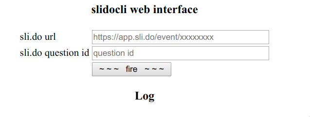

# slidocli web interface 1

Use files in this directory to serve `slidocli` as a web interface for use via mobile phones or tablets.

## Configuration

Set the full path to `slidocli` in `post.php` before usage.

## Preview

## Lazy Docker

If you are not in the mood setting up a web server with PHP, use the bundled [docker-compose.yml](../docker/)
file and start configuration-less with `docker-compose up`.
